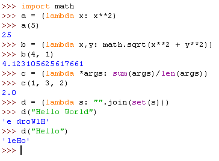

# DAFTAR TUGAS

<table border="2" cellpading="10">
  <tr>
    <td><b>Pertemuan 4</b></td>
    <td>Latihan VCS</td>
    <td><a href="https://github.com/IlhamLamp/LatihanVCS">Klik disini</td>
  </tr>
  <tr>
    <td><b>Pertemuan 5</b></td>
    <td>Program Biodata</td>
    <td><a href="https://github.com/IlhamLamp/Program-menginputkan-biodata">Klik disini</td>
  </tr>
  <tr>
    <td><b>Pertemuan 6</b></td>
    <td>Lab1 dan 2</td>
    <td><a href="https://github.com/IlhamLamp/ProjectPraktikum">Klik disini</td>
  </tr>
  <tr>
    <td><b>Pertemuan 7</b></td>
    <td>Lab3</td>
    <td><a href="https://github.com/IlhamLamp/Lab3">Klik disini</td>
  </tr>
  <tr>
    <td></td>
    <td>Labspy02</td>
    <td><a href="https://github.com/IlhamLamp/labspy02">Klik disini</td>
  </tr>
  <tr>
    <td></td>
    <td>Labpy03</td>
    <td><a href="https://github.com/IlhamLamp/labpy03">Klik disini</td>
  </tr>
  <tr>
    <td><b>Pertemuan 9</b></td>
    <td>Lab 4</td>
    <td><a href="https://github.com/IlhamLamp/Lab-4">Klik disini</td>
  </tr>
  <tr>
    <td></td>
    <td>Lab 5</td>
    <td><a href="https://github.com/IlhamLamp/Lab-5">Klik disini</td>
  </tr>
  <tr>
    <td><b>Pertemuan 10</b></td>
    <td>Lab 6</td>
    <td><a href="https://github.com/IlhamLamp/Lab-6">Klik disini</td>
  </tr>
</table>

# LAB 6

## LATIHAN

### Soal

### Jawaban
  - Buka text editor atau IDLE python kemudian salin kode berikut.

        import math     #mengimpor modul math

        # A
        '''
        def a(x):
            return x**2
        '''
        a = (lambda x: x**2)
        a(5)

        # B
        '''
        def b(x, y):
            return math.sqrt(x**2 + y**2)
        '''
        b = (lambda x,y: math.sqrt(x**2 + y**2))
        b(4, 1)

        # C
        '''
        def c(*args):
            return sum(args)/len(args)
        '''
        c = (lambda *args: sum(args)/len(args))
        c(1, 3, 2)

        # D
        '''
        def d(s):
            return "".join(set(s))
        '''
        d = (lambda s: "".join(set(s)))
        d("Hello World")
        d("Hello")

  - Simpan dengan nama `latihan.py`, kemudian jalankan programnya. Maka akan menghasilkan output sebagai berikut.

  

## Tugas Praktikum

### Soal

  

### Jawaban
  - Buka text editor, kemudian salin kode berikut

    

    Simpan dengan nama `main.py`

  - Selanjutnya buat foder dengan nama `data`. Lalu masuik ke folder tersebut.

  - Buka text editor lagi, kemudian salin kode berikut

    

    Simpan dengan nama `daftar.py`

  - Salin lagi kode berikut

    

    Simpan dengan nama `tambah.py`

  - Salin lagi kode berikut

    

    Simpan dengan nama `hapus.py`

  - Salin lagi kode berikut

    

    Simpan dengan nama `tampilkan.py`

  - Salin lagi kode berikut

    

    Simpan dengan nama `ubah.py`

  - Terakhir, salin kode berikut

    

    Simpan dengan nama `__init__.py`

  - Lalu jalankan program `main.py`, maka akan menghasilkan output berikut

    - Operasi Tambah

      

    - Operasi Tampilkan

      

    - Operasi Ubah

      

    - Operasi hapus

      

### Penjelasan

  - Di dalam file `main.py` terdapat kode `import data`, yang akan mengimpor semua modul yang ada pada foler `data`. Folder `data` disini bertindak sebagai **Package**.

  -  `daftar.py`,`tambah.py`,`ubah.py`,`tampilkan.py`,`hapus.py` sebagai modul, dan didalam nya terdapat fungsinya masing-masing.

  - modul `__init__.py` sebagai inisialisasi, agar file dari `daftar.py`,`tambah.py`,`ubah.py`,`tampilkan.py`,`hapus.py` dapat menjadi Modul, dan folder `data` akan menjadi Package.

  - Ketika program di jalankan, pilihan `1` untuk menamba data, `2` untuk menampilkan data, `3` untuk menghapus data, `4` untuk mengubah data, dan `5` akan membuat program berhenti dari _looping_.
